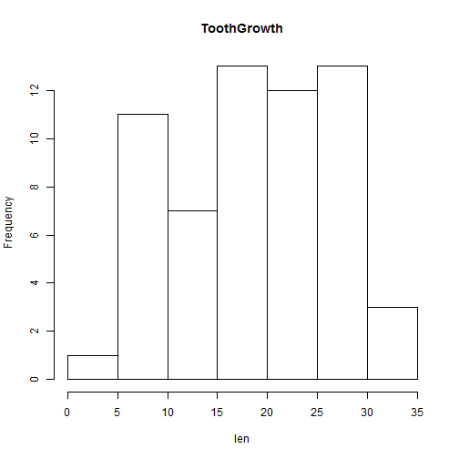
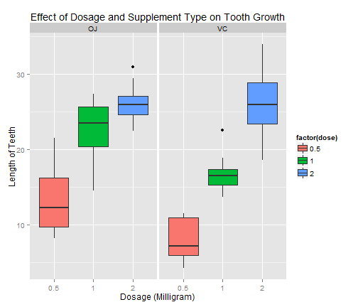

ToothGrowth
========================================================

Now in the second portion of the class, we're going to analyze the ToothGrowth data in the R datasets package. 
Load the ToothGrowth data and perform some basic exploratory data analyses 
Provide a basic summary of the data.
Use confidence intervals and/or hypothesis tests to compare tooth growth by supp and dose. (Only use the techniques from class, even if there's other approaches worth considering)
State your conclusions and the assumptions needed for your conclusions. 
Some criteria that you will be evaluated on
Did you  perform an exploratory data analysis of at least a single plot or table highlighting basic features of the data?
Did the student perform some relevant confidence intervals and/or tests?
Were the results of the tests and/or intervals interpreted in the context of the problem correctly? 
Did the student describe the assumptions needed for their conclusions?


```r
data(ToothGrowth)
summary(ToothGrowth)
```

```
##       len       supp         dose     
##  Min.   : 4.2   OJ:30   Min.   :0.50  
##  1st Qu.:13.1   VC:30   1st Qu.:0.50  
##  Median :19.2           Median :1.00  
##  Mean   :18.8           Mean   :1.17  
##  3rd Qu.:25.3           3rd Qu.:2.00  
##  Max.   :33.9           Max.   :2.00
```

```r
head(ToothGrowth)
```

```
##    len supp dose
## 1  4.2   VC  0.5
## 2 11.5   VC  0.5
## 3  7.3   VC  0.5
## 4  5.8   VC  0.5
## 5  6.4   VC  0.5
## 6 10.0   VC  0.5
```

```r
hist(ToothGrowth$len, xlab = 'len', main = 'ToothGrowth')
```

 


```r
# Mean of Len
mean(ToothGrowth$len)
```

```
## [1] 18.81
```

```r
# Sd of Len
sd(ToothGrowth$len)
```

```
## [1] 7.649
```

Expolratory Analysis:


```r
library(ggplot2)
```

```
## Warning: package 'ggplot2' was built under R version 3.0.3
```

```r
plot <- ggplot(ToothGrowth, 
               aes(x=factor(dose),y=len,fill=factor(dose)))
plot + geom_boxplot(notch=F) + facet_grid(.~supp) +
  scale_x_discrete("Dosage (Milligram)") +   
  scale_y_continuous("Length of Teeth") +  
  ggtitle("Effect of Dosage and Supplement Type on Tooth Growth")
```

 

Calculate the confidence interval using T test


```r
supp.t1 <- t.test(len~supp, paired=F, var.equal=T, data=ToothGrowth)
supp.t2 <- t.test(len~supp, paired=F, var.equal=F, data=ToothGrowth)
supp.result <- data.frame("p-value"=c(supp.t1$p.value, supp.t2$p.value),
                          "Conf-Low"=c(supp.t1$conf[1],supp.t2$conf[1]),
                          "Conf-High"=c(supp.t1$conf[2],supp.t2$conf[2]),
                          row.names=c("Equal Var","Unequal Var"))
supp.result
```

```
##             p.value Conf.Low Conf.High
## Equal Var   0.06039   -0.167     7.567
## Unequal Var 0.06063   -0.171     7.571
```

Conclusion:
Based on the sample data provided:

1. At lower dosages (.5 Mg - 1 Mg), orange juice provides more tooth growth than ascorbic acid.

2. At the higher dosage (2 Mg), the rate of tooth growth is not statistically different between supplement methods.

3. Regardless of the supplement method, dosage is a key factor in tooth growth.
